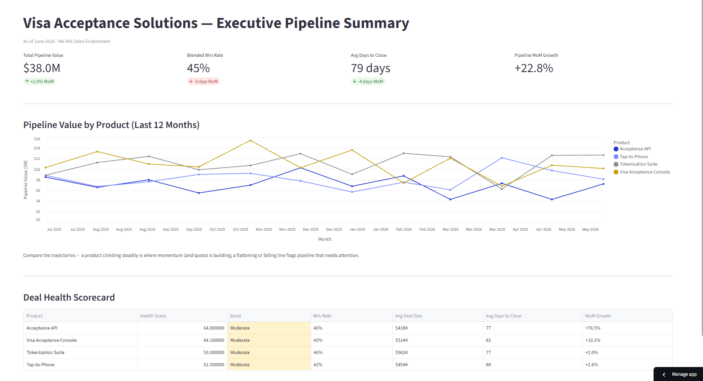
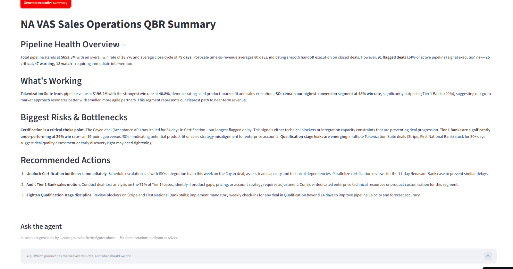
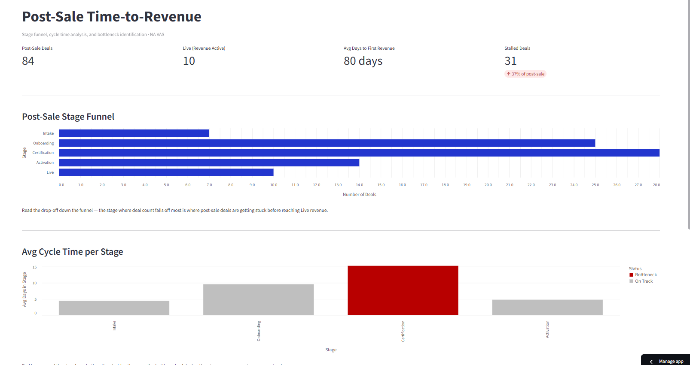
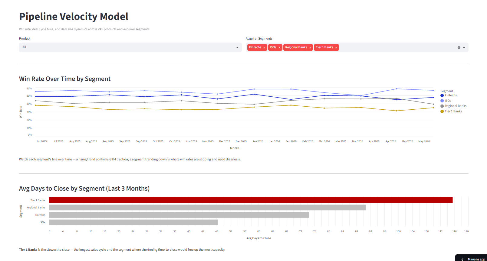

# Visa NA VAS — Sales Enablement & AI Workflow Analyst

### [Live Dashboard →](https://sales-analyst-hpecckbmvzzbhe6a5owuax.streamlit.app/)

**A five-page NA VAS sales-enablement dashboard — pipeline analytics, velocity, post-sale time-to-revenue, automated deal monitoring, and a Claude-powered AI agent that answers pipeline questions and auto-writes executive summaries.**

---

This project models the analytical and AI-automation work of an AI Workflow / Solutions Analyst on Visa's North America Visa Acceptance Solutions (NA VAS) team. It synthesises monthly pipeline data across VAS products and acquirer segments plus individual deal snapshots to track pipeline health, velocity, and post-sale time-to-revenue — then layers on AI: automated deal monitoring with next-best-action recommendations, and a conversational **AI Workflow Agent** that answers natural-language questions about the data and generates exec-ready summaries, grounded in the dashboard's computed metrics.

## Key Insights

- **Pipeline & velocity:** The Executive Summary and Velocity pages surface win-rate trends, days-to-close, and where to focus GTM effort by product and acquirer segment.
- **Time-to-revenue:** The post-sale funnel flags stages that exceed cycle-time thresholds (bottlenecks) — the friction that delays revenue realization after a deal closes.
- **AI automation:** The AI Insight Engine auto-monitors deals and surfaces stalled ones with next-best actions; the AI Workflow Agent lets a sales leader ask questions in plain English and get grounded answers + one-click executive summaries, eliminating manual data pulls.

## Dashboard Pages

1. **Executive Pipeline Summary** — portfolio KPIs, pipeline trend, deal-health scorecard.
2. **Pipeline Velocity Model** — win rate over time, days-to-close, deal-size vs win-rate.
3. **Post-Sale Time-to-Revenue** — stage funnel, cycle-time bottleneck flagging.
4. **AI Insight Engine** — automated deal monitoring + next-best-action recommendations.
5. **AI Workflow Agent** — Claude-powered Q&A over the data + one-click executive summary.

## Tech Stack

| Layer | Tool |
|---|---|
| Data | Two synthesized CSVs — Python generator script |
| Data Processing | Pandas |
| Pure functions | `compute_deal_health`, `compute_ai_recommendations`, `build_context` (no Streamlit dependency) |
| AI Agent | Anthropic Claude (`claude-haiku-4-5`) — grounded, no code execution |
| Visualisation | Altair |
| Dashboard | Streamlit (five-page multipage app) |
| Testing | pytest |
| Deployment | Streamlit Community Cloud |

## Running locally

1. `pip install -r requirements.txt`
2. Copy `.env.example` to `.env` and set `ANTHROPIC_API_KEY` (only needed for the AI agent page).
3. `cd streamlit_app && streamlit run 1_pipeline_summary.py`
4. Tests: `pytest` (from the project root; the agent is tested with a mocked client — no API key needed).

## Repository Structure

    .
    ├── streamlit_app/
    │   ├── 1_pipeline_summary.py
    │   ├── pages/
    │   │   ├── 2_pipeline_velocity.py
    │   │   ├── 3_time_to_revenue.py
    │   │   ├── 4_ai_insight_engine.py
    │   │   └── 5_ai_workflow_agent.py     # AI agent: Q&A + exec summary
    │   ├── utils/
    │   │   ├── data_loader.py
    │   │   ├── deal_health.py
    │   │   ├── ai_recommendations.py
    │   │   └── sales_agent.py             # grounded context + Claude calls
    │   ├── data/
    │   └── generate_data.py
    ├── tests/
    ├── requirements.txt
    ├── pytest.ini
    └── README.md
